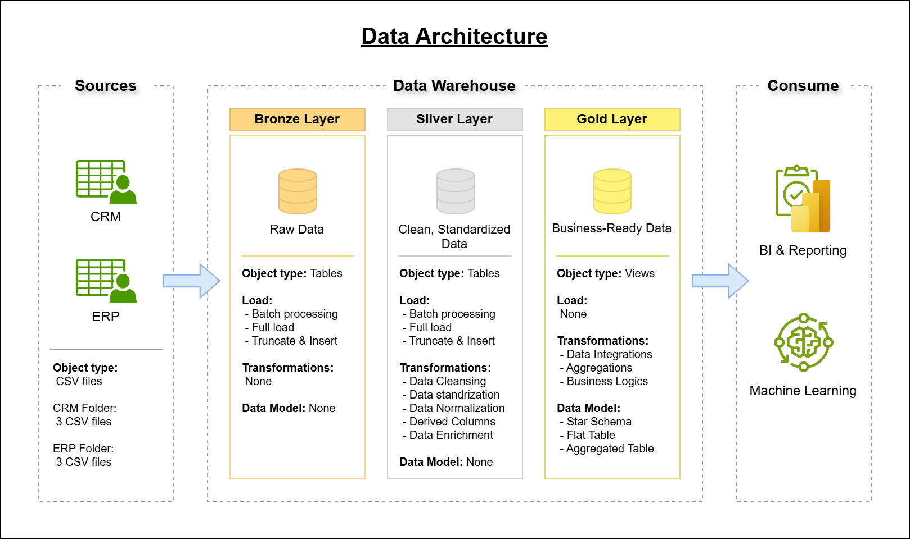
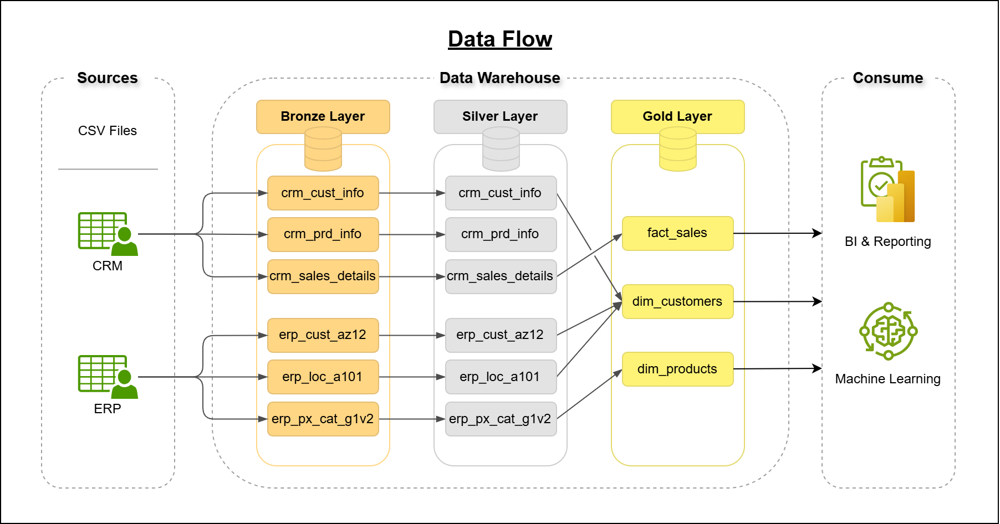
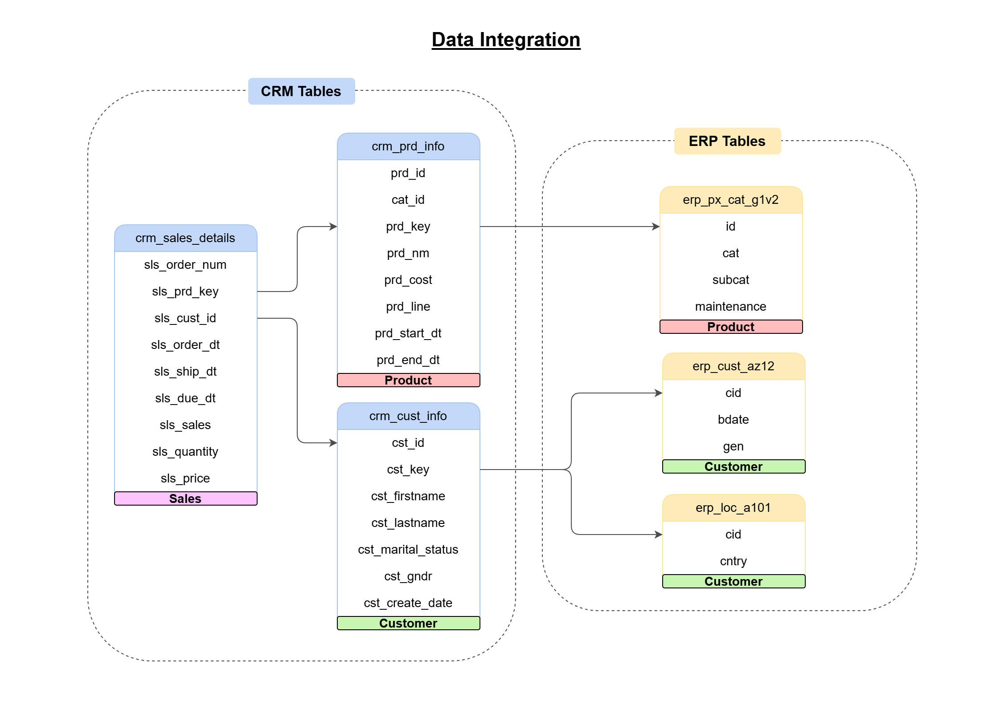

# SQL_Data_Warehouse_Project
This project demonstrates the development of a data warehouse using Microsoft SQL Server, following the medallion architecture to integrate and transform ERP and CRM data. 

## Dataset
The project is based on six CSV files of raw operational data from enterprise systems:
 - ERP data (3 files): e.g., sales, inventory, suppliers
 - CRM data (3 files): e.g., customers, leads, interactions

## Project Overview
This project includes:

 ### **1. Data Architecture:**
 Designing a Modern Data Warehouse Using Medallion Architecture Bronze, Silver, and Gold layers.

 

 * **Bronze Layer:** 
    This layer stores raw data ingested from the source systems (CSV files) into SQL server Database.
* **Silver Layer:**
    This layer includes the transformation processes (data cleansing, standardization, normalization) to prepare the data for analysis.
* **Gold Layer:**
    This layer includes business-ready data modeled into a star schema, ready for reporting and analytics.


### **2. ETL Pipelines:** Extracting, transforming, and loading data from source systems into the warehouse.
 

 

### **3. Data Modeling:** Developing fact and dimension tables optimized for analytical queries.
 

### **4. Analytics & Reporting:** Creating SQL-based reports and dashboards for actionable insights.


## Project Structure
```
SQL_Data_Warehouse_Project/
|
|-datasets/
|   |-
|
|-documents/
|   |-data_architecture.png
|
|-scripts
|
|-tests
|
```