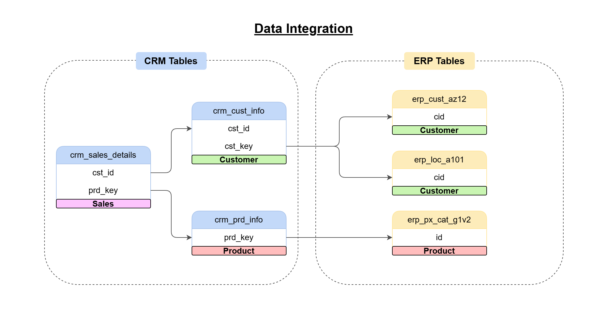
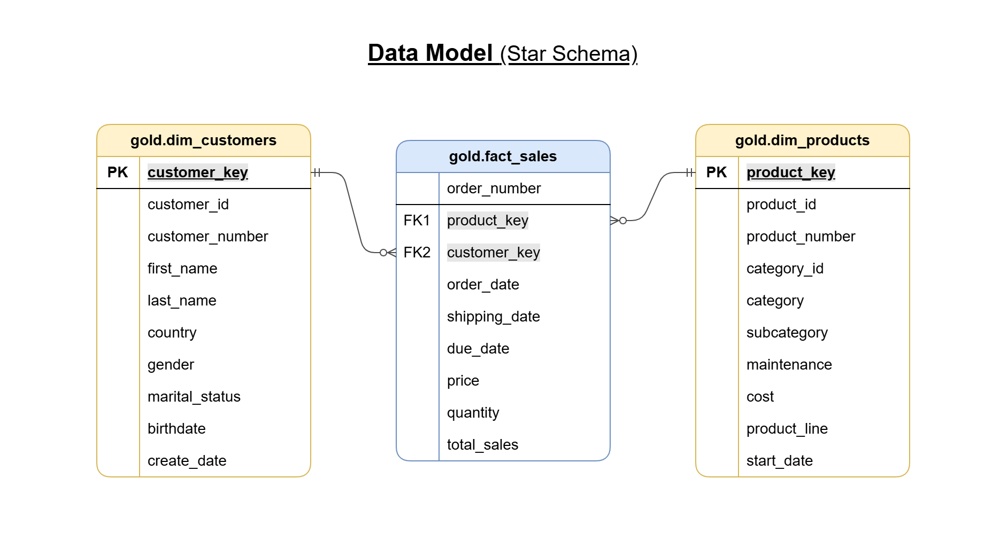

# SQL_Data_Warehouse_Project
This project demonstrates the development of a data warehouse using Microsoft SQL Server, following the medallion architecture to integrate and transform ERP and CRM data. 

## Dataset
The project is based on six CSV files of raw operational data from enterprise systems:
 - ERP data (3 files): e.g., sales, inventory, suppliers
 - CRM data (3 files): e.g., customers, leads, interactions

## Project Overview
This project includes:

 ### **1. Data Architecture:**
 Designing a Modern Data Warehouse Using Medallion Architecture Bronze, Silver, and Gold layers.

 

 * **Bronze Layer:** 
    This layer stores raw data ingested from the source systems (CSV files) into SQL server Database.
* **Silver Layer:**
    This layer includes the transformation processes (data cleansing, standardization, normalization) to prepare the data for analysis.
* **Gold Layer:**
    This layer includes business-ready data modeled into a star schema, ready for reporting and analytics.


### **2. ETL Pipelines:**
Extracting, transforming, and loading data from source systems into the warehouse.

 

 

### **3. Data Modeling:**
Developing fact and dimension tables optimized for analytical queries.

 

### **4. Analytics & Reporting:**
Creating SQL-based reports and dashboards for actionable insights.


## Project Structure
```
SQL_Data_Warehouse_Project/
|
|-datasets/                         # Raw datasets used for the project
|   |-source_crm/                   # CRM data
|       |-cust_info.csv
|       |-prd_info.csv
|       |-sales_details.csv
|   |-source_erp/                   # ERP data
|       |-CUST_AZ12.csv
|       |-LOC_A101.csv
|       |-PX_CAT_G1V2.csv
|
|-documents/                        # Project documentation and architecture details
|   |-data_catalog.md
|   |-naming_conventions.md
|   |-project_diagrams.drawio
|   |-data_architecture.png
|   |-data_flow.png
|   |-data_integration.png
|   |-data_integration_short.png
|   |-data_model.png
|
|-scripts/                          # SQL scripts for ETL and transformations
|   |-bronze_layer/                 # Scripts for extracting and loading raw data
|       |-create_bronze.sql
|       |-load_bronze.sql
|   |-silver_layer/                 # Scripts for cleaning and transforming data
|       |-create_silver.sql
|       |-load_silver.sql
|   |-gold_layer/                   # Scripts for creating analytical models
|       |-gold_views.sql
|
|-tests/                            # Test scripts and quality files
|   |-silver_quality_checks.sql
|
|-README.md                         # Project overview and structure
|-.gitignore                        # Files to be ignored by Git
```