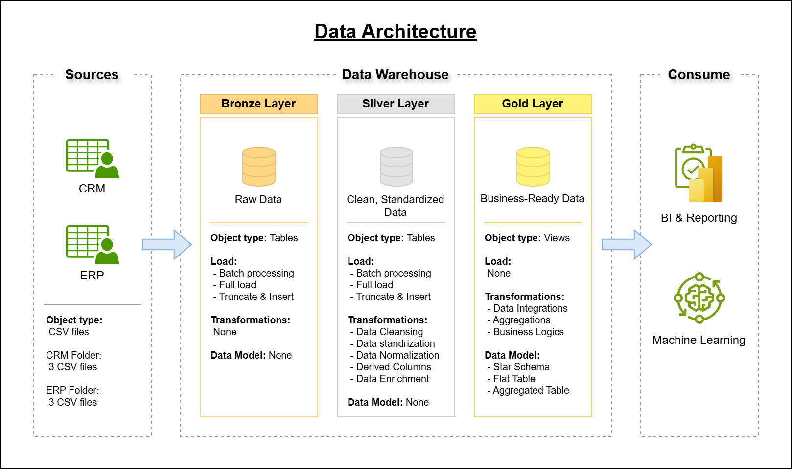

# SQL_Data_Warehouse_Project
This project demonstrates the development of a data warehouse using Microsoft SQL Server, following the medallion architecture to integrate and transform ERP and CRM data. 

## Dataset
The project is based on six CSV files of raw operational data from enterprise systems:
 - ERP data (3 files): e.g., sales, inventory, suppliers
 - CRM data (3 files): e.g., customers, leads, interactions

## Data Architecture
The project pipeline is designed based on the medallion approach with three layers of data

 * Bronze Layer: 
    This layer stores raw data ingested from the source systems (CSV files) into SQL server Database.

 * Silver Layer:
    This layer includes the transformation processes (data cleansing, standardization, normalization) to prepare the data for analysis.

 * Gold Layer:
    This layer includes business-ready data modeled into a star schema, ready for reporting and analytics.

